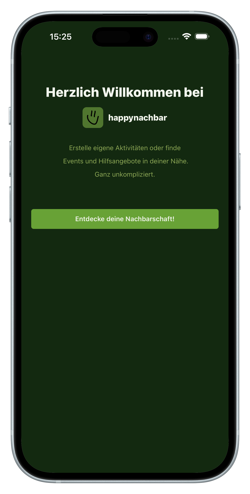
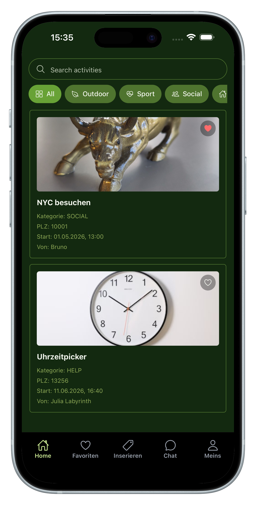
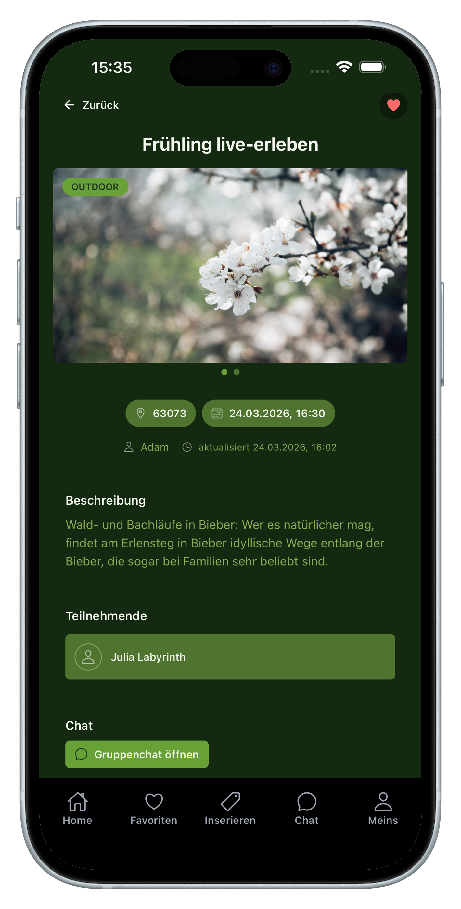
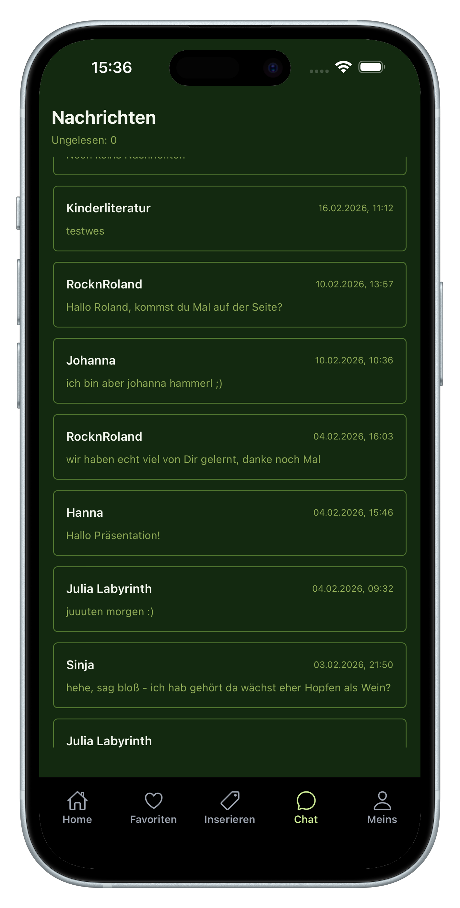
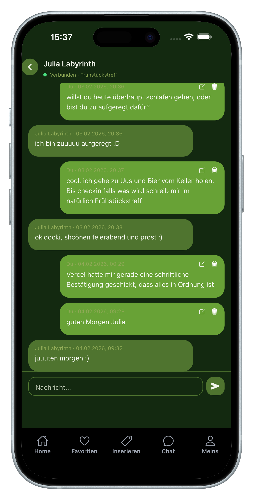
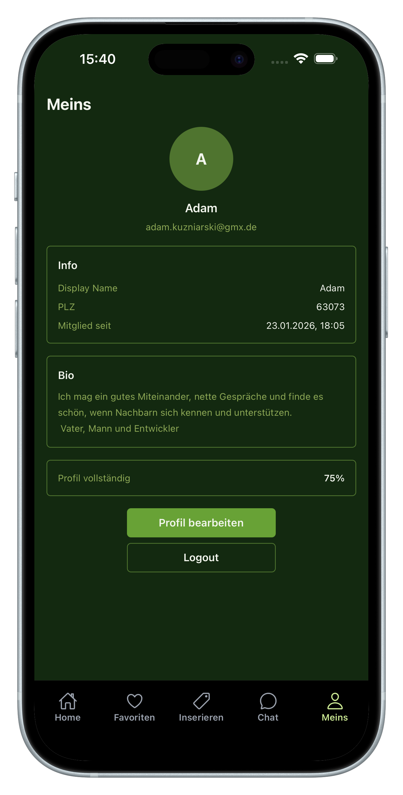

<a id="readme-top"></a>

<div align="center">


<br />

<h1 align="center">happynachbar mobile</h1>

<p align="center">
  A mobile-first neighborhood app for discovering nearby activities, saving favorites, joining events, and chatting with people in your area.
  <br />
  Built with Expo, React Native, TypeScript, and Expo Router.
  <br />
  <a href="#preview">Preview</a>
  ·
  <a href="#features">Features</a>
  ·
  <a href="#tech-stack">Tech Stack</a>
  ·
  <a href="#project-structure">Project Structure</a>
  ·
  <a href="#local-setup">Local Setup</a>
</p>

</div>

<details>
  <summary>Table of Contents</summary>
  <ol>
    <li><a href="#overview">Overview</a></li>
    <li><a href="#features">Features</a></li>
    <li><a href="#preview">Preview</a></li>
    <li><a href="#tech-stack">Tech Stack</a></li>
    <li><a href="#project-structure">Project Structure</a></li>
    <li><a href="#local-setup">Local Setup</a></li>
    <li><a href="#testing">Testing</a></li>
    <li><a href="#api-connection">API Connection</a></li>
  </ol>
</details>

<br />

<h2 id="overview">Overview</h2>

<p>
This repository contains the mobile client for happynachbar. The app is focused on helping neighbors discover local activities, join events, save favorites, and stay connected through chat.
</p>

<p>
Even though the wider happynachbar ecosystem includes web and backend services, this README is intentionally focused on the mobile experience and mobile development workflow.
</p>

<p align="right">(<a href="#readme-top">back to top</a>)</p>

<h2 id="features">Features</h2>

- Browse activities with search and category filters.
- Open detailed activity pages with images, schedule, location, and participant info.
- Save activities to favorites.
- Create new activities with title, description, category, postal code, date, and images.
- Use real-time chat and message inbox views.
- Manage profile data and account information.
- Authentication flows for login, registration, and password recovery.

<p align="right">(<a href="#readme-top">back to top</a>)</p>

<h2 id="preview">Preview</h2>

<div align="center">
  
  
  
</div>

<br />

<div align="center">
  
  
  
</div>

<p align="right">(<a href="#readme-top">back to top</a>)</p>

<h2 id="tech-stack">Tech Stack</h2>

- Expo `~55.0.15`
- React Native `0.83.4`
- React `19.2.0`
- TypeScript `~5.9.2`
- Expo Router `^55.0.12`
- NativeWind `^4.2.2`
- Socket.IO Client `^4.8.3`
- Expo Secure Store
- Expo Image Picker
- Jest + ts-jest
- EAS Build

<p align="right">(<a href="#readme-top">back to top</a>)</p>

<h2 id="project-structure">Project Structure</h2>

```text
apps/mobile/
├─ src/app/                # routes (landing, auth, home, messages, profile, create)
├─ src/components/         # reusable UI and feature components
├─ src/lib/                # API, auth, chat, activities, uploads, helpers
├─ assets/                 # icons, splash, images
├─ __tests__/              # unit tests
├─ .maestro/               # mobile flow / e2e scripts
├─ app.json                # Expo config
└─ eas.json                # EAS build profiles